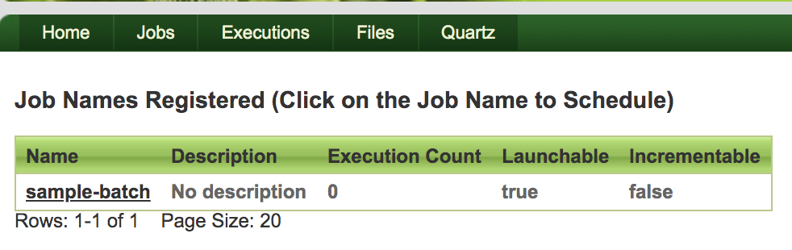
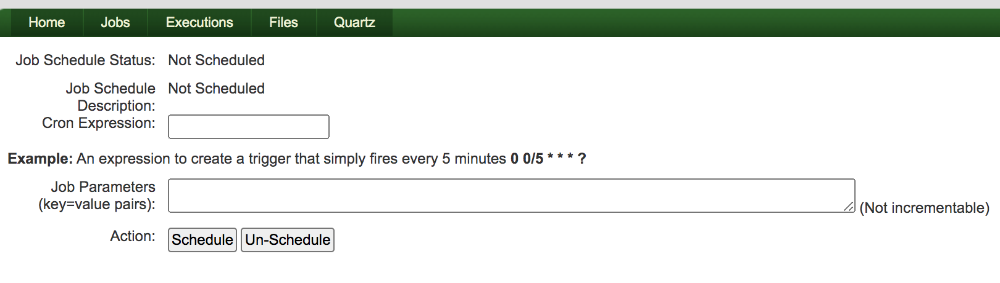
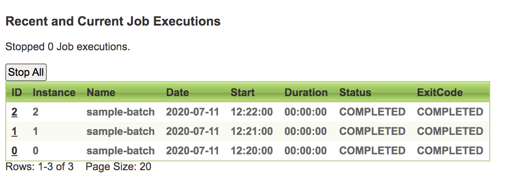

# Spring batch admin with quartz implementation

This project incorporates the [Quartz](https://quartz-scheduler.org/) scheduler along with the Spring Batch admin. A new page "Quartz" is setup for accepting the CRON expression for the scheduling of the application.

# Building the project

The project can be built as a Docker container, exposed on port `9001`

```
docker-compose up --build
```

# Accessing the application

- Navigate to `http://localhost:9001/spring-batch-quartz-admin/`
- Browse to the `Quartz` tab. You can schedule the sample job and look at the executions as well






